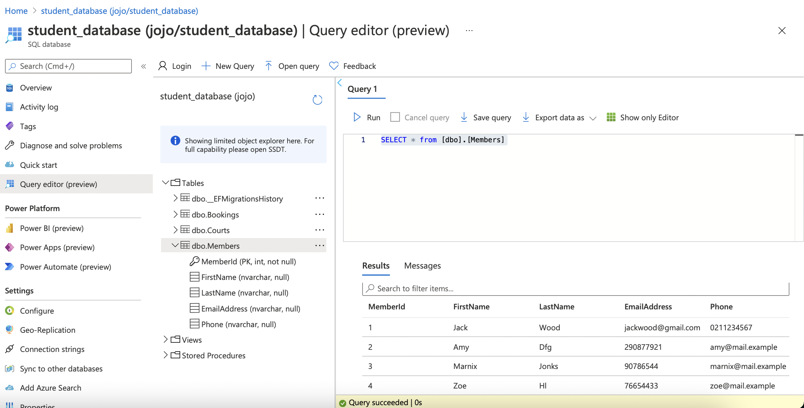
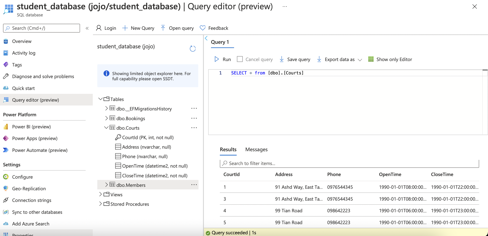
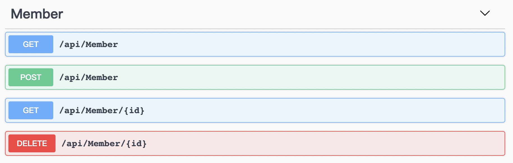
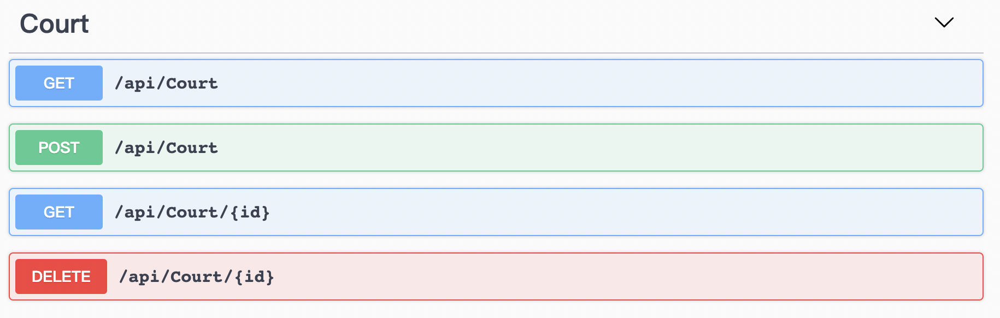
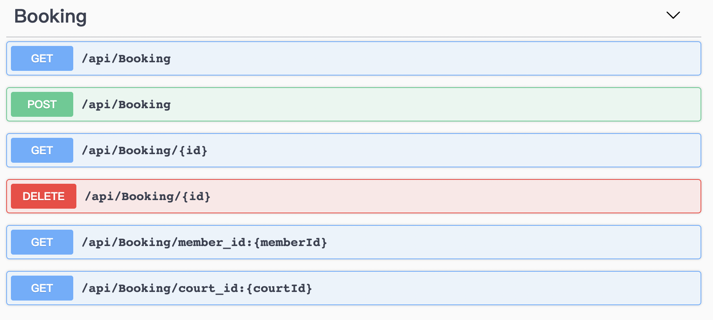

# Badminton Databases and API

> Authored by Jojo Dong on 29 March 2021

https://badmintonapi.azurewebsites.net/swagger/index.html

## Database Tables
There database tables are created by migrating from [Member](./Models/Member.cs), [Court](./Models/Court.cs) and [Booking](/Models/Booking.cs) models with EntityFrameworkCore.
### Member Table

### Court Table

### Booking Table

## API

[MemberController](./Controllers/MemberController.cs), [CourtController](./Controllers/CourtController.cs) and [BookingController](./Controllers/BookingController.cs) are responsible for the APIs to conduct CRUD operations on Member, Court and Booking. 

### Member API

### Court API

### Booking API
